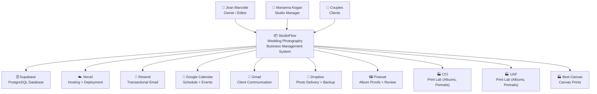
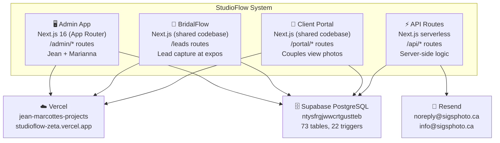
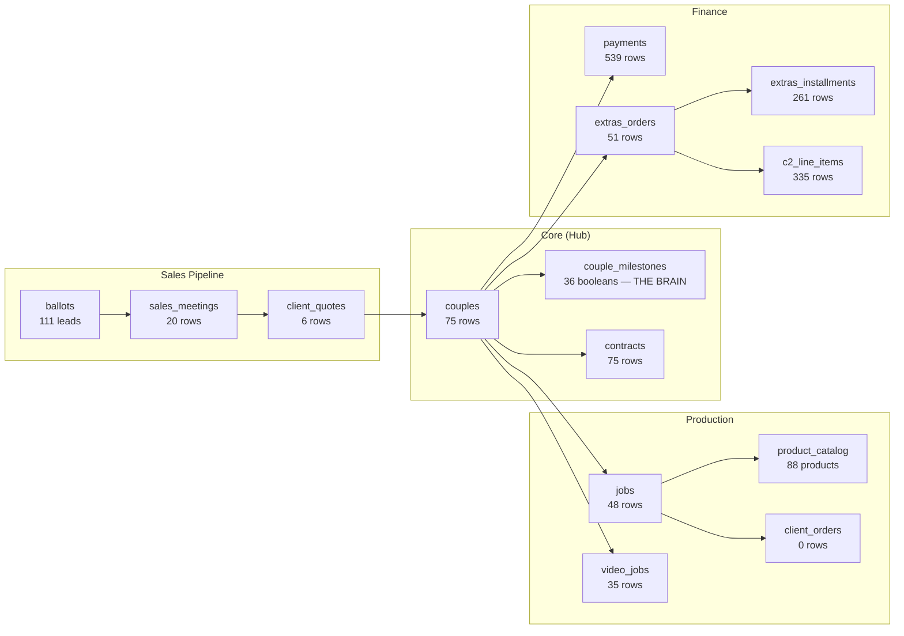

# ARCHITECTURE.md
**StudioFlow — System Architecture Document**
**Version:** 1.0
**Created:** April 25, 2026
**Last Verified:** April 25, 2026

---

## 1. Purpose

StudioFlow is the internal business management system for SIGS Photography Ltd., a Toronto/Vaughan wedding photography studio with 25+ years of experience. It manages the complete client lifecycle — from lead capture at bridal expos through contract signing, production tracking, and final delivery.

This document is the single source of truth for how StudioFlow is architected. It lives in the GitHub repo alongside the code it describes. When the code changes, this document changes in the same commit.

**If it's not in `/docs/`, it doesn't exist.**

---

## 2. Stakeholders

| Who | Role | Uses |
|-----|------|------|
| **Jean Marcotte** | Owner, Lead Photographer, Video Editor, Developer | Everything — admin, production, sales, editing |
| **Marianna Kogan** | Studio Manager | BridalFlow (lead follow-up), client communication, vendor pickups |
| **Couples** | Clients | Client Portal (future: proof approval, album review) |
| **Claude (AI)** | Development partner | Code generation, data queries, session management |
| **Cole Fulton** | Principal 2nd shooter | No system access (photos only, no editing) |
| **Jeyaram Duraisingam** | 2nd shooter / Video | No system access (shooter, not editor) |

---

## 3. System Context (C4 Level 1)

This is the 30,000-foot view. StudioFlow as one system, showing who uses it and what external services it connects to.

### External System Details

| System | Integration Type | Purpose |
|--------|-----------------|---------|
| **Supabase** | Direct (JS client + SQL) | All data storage — couples, contracts, jobs, milestones, payments, ballots |
| **Vercel** | Deployment platform | Hosts the Next.js app at studioflow-zeta.vercel.app |
| **Resend** | API (server-side) | Sends branded emails: crew call sheets, weekly reports, portal invites |
| **Google Calendar** | Read-only (manual) | Jean's schedule — not programmatically synced to StudioFlow |
| **Gmail** | Manual | Client communication — no API integration |
| **Dropbox** | File sync (local) | Photo proof delivery to couples, backup storage |
| **Pixieset** | External platform | Album proof review — couples view and approve album designs here |
| **CCI / UAF / Best Canvas** | Manual (ROES app, WeTransfer, online) | Physical product ordering — not integrated via API |

---

## 4. Container Diagram (C4 Level 2)

Zooming into StudioFlow. These are the separately deployable units.

### Container Details

| Container | Technology | URL | Purpose |
|-----------|-----------|-----|---------|
| **Admin App** | Next.js 16, React 19, Tailwind, shadcn/ui | studioflow-zeta.vercel.app/admin | All business management — couples, production, sales, finance, documents |
| **BridalFlow** | Same Next.js app, separate layout | studioflow-zeta.vercel.app/leads | Lead capture at bridal expos, lead scoring algorithm, follow-up tracking |
| **Client Portal** | Same Next.js app, Supabase Auth | studioflow-zeta.vercel.app/portal | Couple-facing: view photos, approve albums (future), payment status |
| **API Routes** | Next.js serverless functions | studioflow-zeta.vercel.app/api | Server-side: email sending, auth, WHOOP sync, portal magic links |
| **Supabase** | PostgreSQL 15, Row Level Security | Project ID: ntysfrgjwwcrtgustteb | 73 tables, 22 triggers, 2 views, 49 foreign keys |

---

## 5. Technology Stack

| Layer | Technology | Why |
|-------|-----------|-----|
| **Frontend** | React 19, Next.js 16 (App Router) | Server Components for data-heavy pages, client components for interactivity |
| **Styling** | Tailwind CSS + shadcn/ui | Utility-first CSS + pre-built accessible components |
| **Database** | Supabase (PostgreSQL 15) | Managed Postgres with auth, storage, real-time, and JS client |
| **Auth** | Supabase Auth (magic links via Resend) | Client portal authentication — admin uses no auth (internal tool) |
| **Email** | Resend | Transactional emails: crew sheets, reports, portal invites |
| **Hosting** | Vercel | Serverless deployment, edge functions, automatic preview deploys |
| **Storage** | Supabase Storage | Portal assets (hero images, collages) in `portal-assets` bucket |
| **Version Control** | GitHub | Private repo: `jean-marcotte/studioflow` |

---

## 6. Data Architecture Overview

### Supabase Project: `ntysfrgjwwcrtgustteb`

73 tables grouped by function. The `couples` table is the hub — 27 other tables reference it via foreign key.

### Table Groups

| Group | Tables | Purpose |
|-------|--------|---------|
| **Core** | couples, contracts, couple_milestones, couple_appointments, couple_documents, couple_charges, wedding_assignments, wedding_day_forms, crew_call_sheets, team_members, team_notes, master_couples | The couple and everything directly attached to them |
| **Sales** | ballots, lead_contacts, lead_sources, sales_meetings, client_quotes, shows, bridal_show_results, scoring_config, chase_templates | BridalFlow lead pipeline → contract conversion |
| **Production** | jobs, video_jobs, video_orders, photo_orders, client_orders, product_catalog, job_status_history, studio_pickup_items, meeting_points | Photo and video editing, lab orders, physical product tracking |
| **Finance** | payments, extras_orders, extras_installments, c2_line_items, c3_line_items, client_extras, contract_installments, payer_links, import_batches | Revenue, C2 frame sales, installment payments, expense tracking |
| **Archive** | archive_couples, archive_drives, archive_milestones, archive_junk, vault_archive, vault_drives, vault_historical_couples, drive_contents | PhotoVault — 721 couples across 25 years of archive drives |
| **System** | settings, app_meta, seo_*, sigs_*, entity_events, legacy_weddings, working_drives | Configuration, SEO tracking, business expenses |

### Views

| View | Purpose |
|------|---------|
| `couple_financial_summary` | Calculates balance_due per couple from contracts + payments |
| `couple_financials` | Extended financial view |

---

## 7. Trigger Architecture

See [TRIGGERS.md](TRIGGERS.md) for the complete trigger registry.

### Summary

| Status | Count |
|--------|-------|
| Active triggers | 38 |
| Milestone triggers (working) | 31 (all m01-m36 except m06_declined/m35_archived) |
| Milestone triggers (missing) | 0 |
| Duplicate triggers | 0 (cleaned up April 25, 2026) |
| Auto-complete triggers | 1 (couples.status on proofs job) |
| Utility triggers | 3 (vendor auto-fill, lead scoring, timestamp) |
| Timestamp triggers | 21 |

---

## 8. Milestone System

See [MILESTONES.md](MILESTONES.md) for the complete milestone registry.

The milestone system is the **brain** of StudioFlow. 36 boolean columns on `couple_milestones` track every couple's journey from lead capture to final delivery.

**Rule #1: Nothing is manual.** Every milestone must be flipped by a database trigger, not by a human clicking a checkbox.

### Current Coverage

| Phase | Milestones | With Trigger | Without Trigger |
|-------|-----------|-------------|----------------|
| Booking (m01–m05) | 5 | 5 ✅ | 0 |
| Engagement (m06–m14) | 8 | 5 | 3 |
| Pre-Wedding (m15–m16) | 2 | 1 | 1 |
| Production (m19–m32) | 12 | 2 | 10 |
| Delivery (m33–m36) | 4 | 1 | 3 |
| **Total** | **36** | **14** | **17** |

*Note: m06_declined is intentionally manual (couple's decision). 5 milestones were gaps (m17, m18, m21, m23 deleted).*

---

## 9. Page Inventory

See [PAGES.md](PAGES.md) for the complete route inventory.

### Route Summary

| Section | Route Prefix | Pages | Purpose |
|---------|-------------|-------|---------|
| Root / Auth | `/`, `/login` | 2 | Landing + admin login |
| Dashboard | `/admin` | 2 | Home — engagement pipeline, week ahead, production, revenue |
| Couples | `/admin/couples` | 4 | Couple list, detail, uploads |
| Production | `/admin/production` | 7 | Photo editing, video editing, add job, equipment, archive, report |
| Sales | `/admin/sales` | 8 | Quotes, frames, extras, revenue, show results, reports |
| Documents & Contracts | `/admin/documents`, `/admin/contracts`, `/admin/albums`, `/admin/extras` | 7 | C1/C2/C3 views, document hub, photo/video order docs |
| Finance | `/admin/finance` | 5 | Overview, income, expenses, reconciliation, tax |
| Wedding Day | `/admin/wedding-day` | 7 | Forms, crew confirm, checklist, coordination, equipment, packing |
| Team | `/admin/team` | 5 | Members, notes, payments, schedule, training |
| Reports | `/admin/reports` | 1 | Business intelligence dashboard |
| Orders | `/admin/orders` | 2 | Client orders list + detail |
| Portal | `/admin/portal`, `/portal` | 3 | Portal editor, login, couple page |
| Client Admin | `/admin/client*` | 5 | Client quotes, communication, extras |
| Marketing & Settings | `/admin/marketing`, `/admin/settings` | 4 | SEO dashboards, settings |
| BridalFlow | `/leads` | 4 | Lead list, compose, analytics, settings |
| Client Forms | `/client` | 9 | Quote builder, photo/video orders, wedding day form, extras |
| Crew Portal | `/crew` | 3 | Login, dashboard, wedding detail |
| Other | Various | 4 | Analytics, ballot, scanner, test-quote |
| **Total** | | **83** | |

---

## 10. Key Architecture Decisions

See [decisions/](decisions/) for full ADRs.

| # | Decision | Rationale |
|---|----------|-----------|
| ADR-001 | **Supabase over Firebase** | PostgreSQL gives us triggers, views, foreign keys, and raw SQL. Firebase's document model doesn't support the relational queries we need. |
| ADR-002 | **Triggers in Postgres, not app code** | Milestones must flip regardless of which UI or API route causes the change. Database triggers are the only way to guarantee this. |
| ADR-003 | **`.limit(1)` not `.single()`** | `.single()` throws an error when 0 rows returned. `.limit(1)` returns empty array. Project-wide rule. |
| ADR-004 | **No Stripe — e-transfers only** | SIGS clients pay via e-transfer. Adding Stripe would add complexity with no benefit. |
| ADR-005 | **Single Next.js app for Admin + BridalFlow + Portal** | Shared components, shared Supabase client, one deployment. Separate layouts provide distinct UX per audience. |
| ADR-006 | **Status derived from actions, not dropdowns** | Statuses should auto-update when checklist items are checked, not manually selected from a dropdown. Reduces human error. |
| ADR-007 | **WO numbers via Postgres SEQUENCE** | Prevents collisions between concurrent Claude agents. Never use `SELECT MAX()`. |

---

## 11. Known Technical Debt

See [TECH-DEBT.md](TECH-DEBT.md) for the full registry.

| Priority | Issue | Impact |
|----------|-------|--------|
| Critical | 16 milestones have no trigger | Client Journey shows incomplete/wrong data |
| Critical | `extras_orders.items` JSONB is template garbage | Cannot trust for production decisions |
| High | Duplicate triggers on m15 and m25 | Two triggers fire for same event — no current harm but messy |
| High | `video_jobs` and `jobs` are separate tables | Should be unified — video production uses different table than photo |
| Medium | No auth on admin routes | Internal tool, but any URL is accessible |
| Medium | `client_orders` table has 0 rows | Built but never populated — Add Editing Job form doesn't use it |
| Low | 82 pages — mobile audit incomplete | 18 WOs shipped April 23-24, but not all verified |

---

## 12. Related Documents

| Document | Location | Purpose |
|----------|----------|---------|
| [TRIGGERS.md](TRIGGERS.md) | `/docs/` | Complete trigger registry with verification dates |
| [MILESTONES.md](MILESTONES.md) | `/docs/` | All 36 milestones with trigger mapping |
| [PAGES.md](PAGES.md) | `/docs/` | Route inventory with read/write/trigger map |
| [STATE-MACHINES.md](STATE-MACHINES.md) | `/docs/` | Valid status transitions per entity |
| [FLOWS.md](FLOWS.md) | `/docs/` | Runtime views: couple books → what happens |
| [DEPLOYMENT.md](DEPLOYMENT.md) | `/docs/` | Vercel, Supabase, Resend, domains, env vars |
| [TECH-DEBT.md](TECH-DEBT.md) | `/docs/` | Known problems, planned fixes, risk level |
| [GLOSSARY.md](GLOSSARY.md) | `/docs/` | Domain + technical terms |
| [decisions/](decisions/) | `/docs/decisions/` | Architecture Decision Records |
| CLAUDE.md | Repo root | Operational rules for Claude agents |
| SIGS-DesignSystem.md | Project files | UI patterns, status colors, component library |

---

## 13. Maintenance Rules

1. **Every commit that changes a table, trigger, page, or status flow updates the relevant `/docs/` file.**
2. **ARCHITECTURE.md gets a version bump and new "Last Verified" date when any structural change occurs.**
3. **Trigger registry (TRIGGERS.md) is re-verified against the database monthly — run the audit query and compare.**
4. **No architectural decision is made without an ADR in `/docs/decisions/`.** Even small ones. "We chose X because Y" takes 5 minutes to write and saves hours of "why did we do this?" later.
5. **Claude Code prompts include: "Update the relevant file in `/docs/`."** This is not optional.

---

*This document was generated from live Supabase queries on April 25, 2026. All table counts, trigger lists, and foreign key relationships are verified against the production database.*
