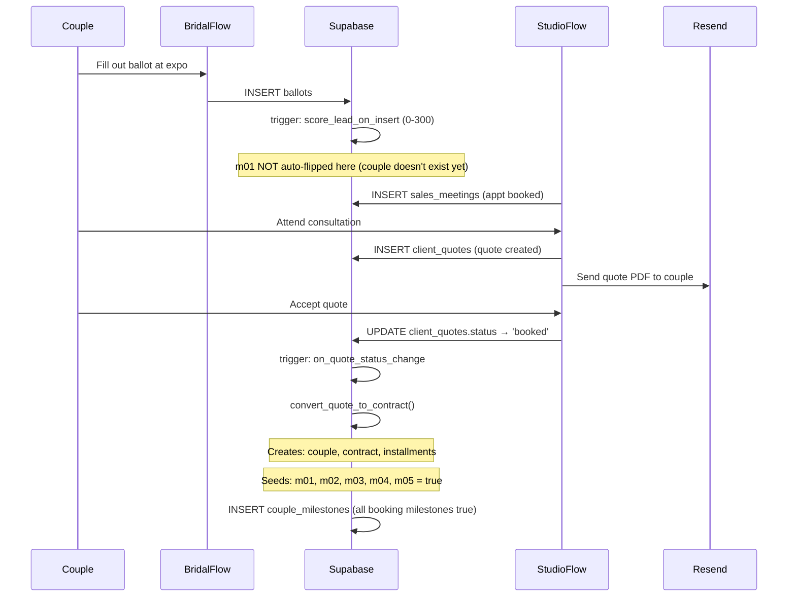
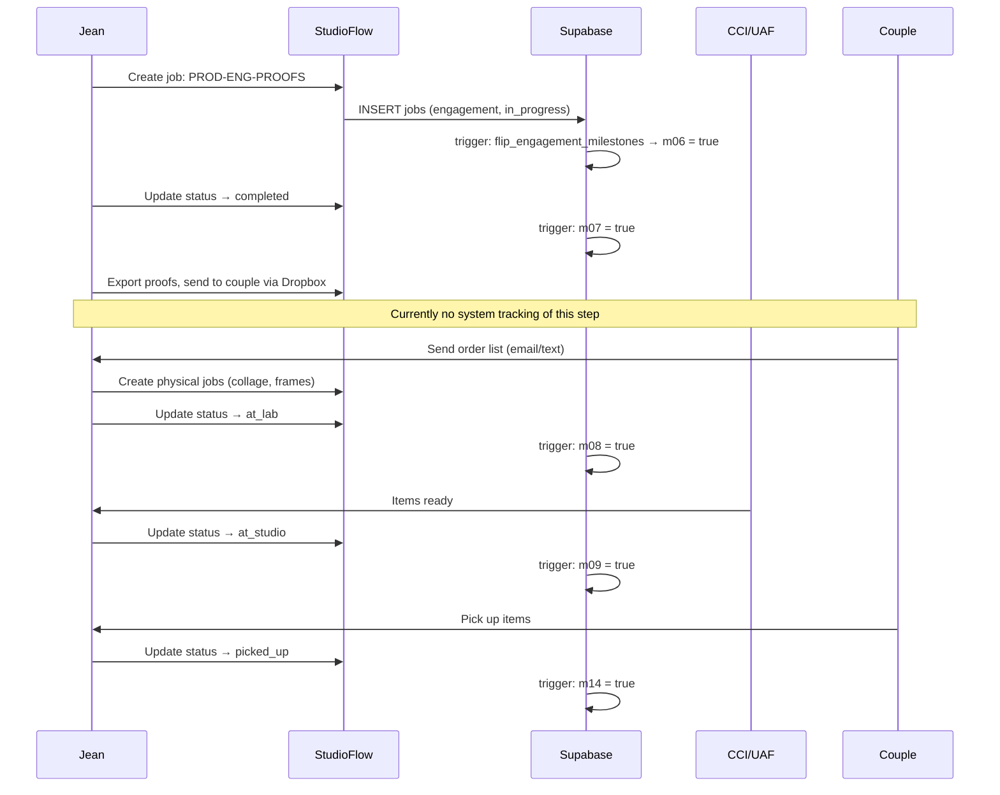
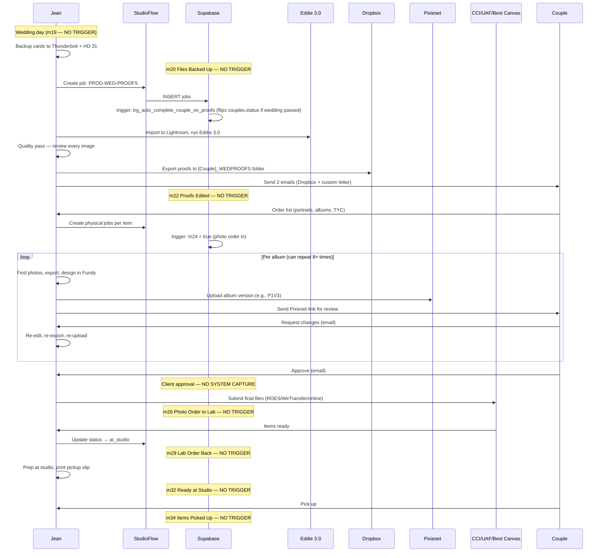
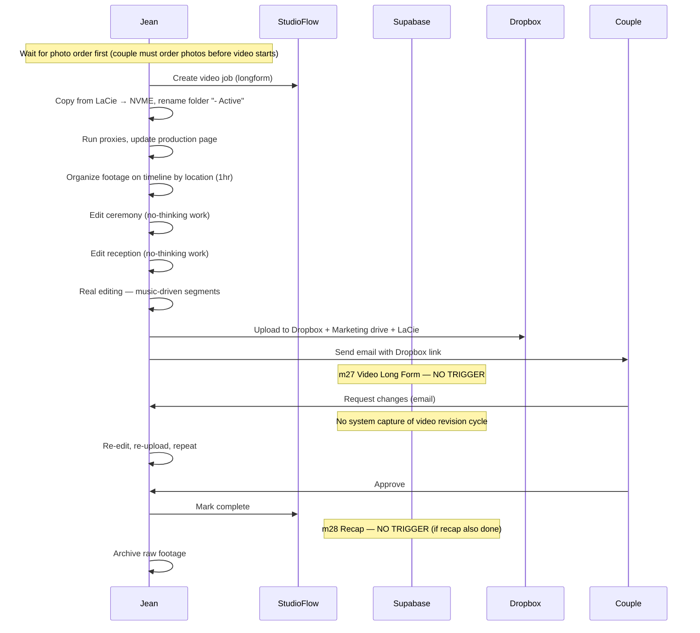
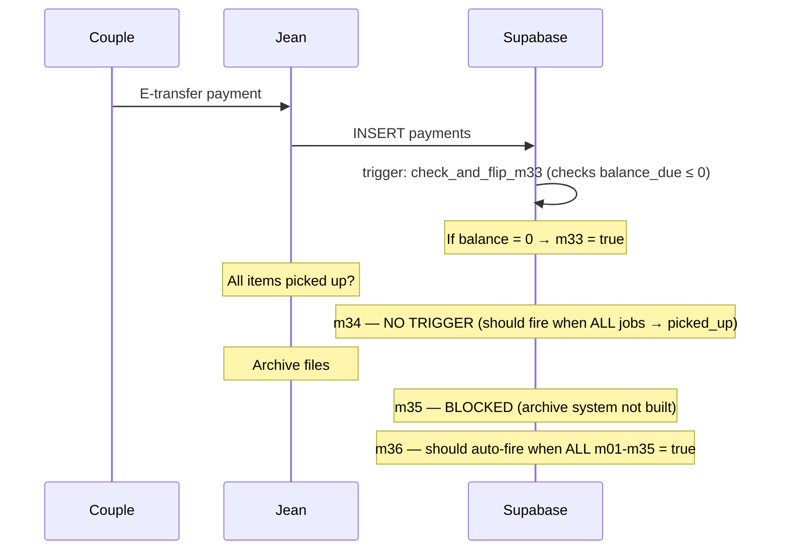

# FLOWS.md
**StudioFlow — Runtime Flow Views**
**Version:** 1.0
**Created:** April 25, 2026
**Last Verified:** April 25, 2026

---

## Flow 1: Lead → Booked Couple

What happens when a couple goes from first contact to signed contract.

---

## Flow 2: Engagement Session (Photo)

What happens from engagement shoot through delivery.

---

## Flow 3: Wedding Photo Production (POST-WEDDING)

What SHOULD happen after the wedding — currently most milestones don't auto-flip.

**This flow makes visible every gap.** The engagement flow (Flow 2) has full trigger coverage. The wedding flow (Flow 3) has almost none.

---

## Flow 4: Video Production

---

## Flow 5: Payment → Final Close

---

## Summary: Trigger Coverage by Flow

| Flow | Steps | Steps with Triggers | Gap |
|------|-------|-------------------|-----|
| Lead → Booked | 5 | 5 (m01-m05) | ✅ None |
| Engagement | 7 | 5 (m06-m09, m14) | 2 missing (m10, m11) |
| Wedding Photo | 12 | 2 (m24, couples.status) | 10 missing |
| Video | 6 | 0 | 6 missing |
| Payment → Close | 4 | 1 (m33) | 3 missing |

---

*Verified against production database and workflow interviews on April 25, 2026.*
