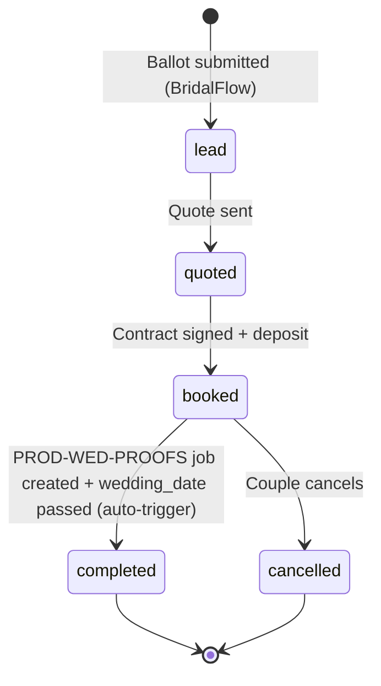
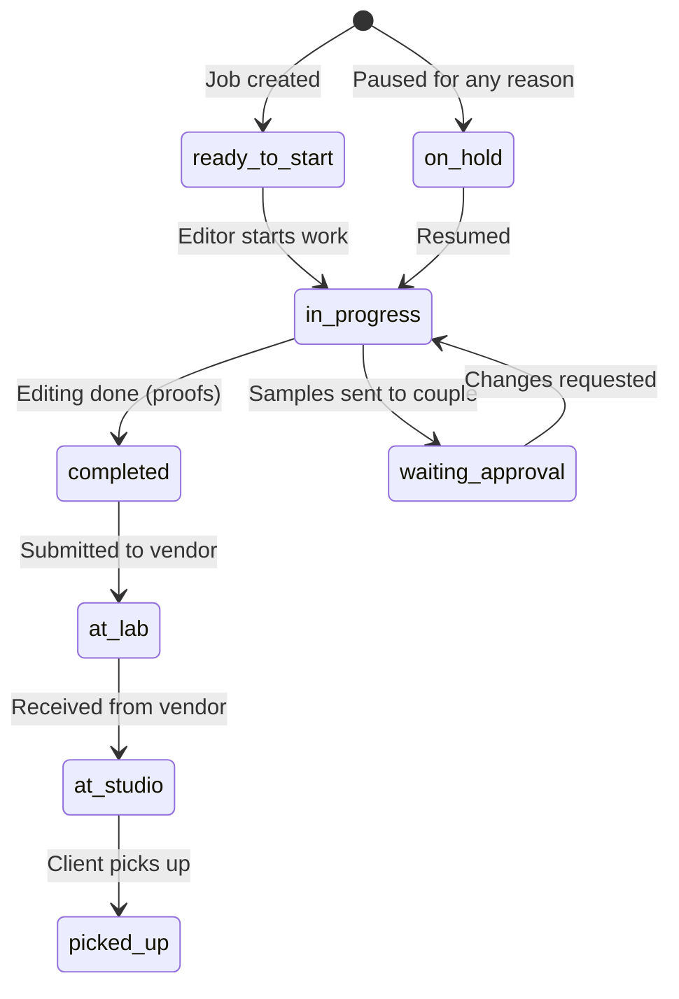
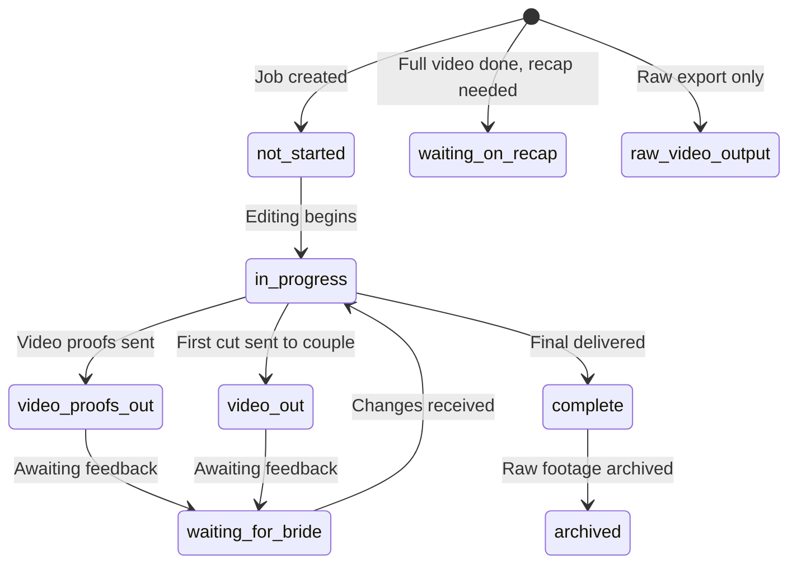
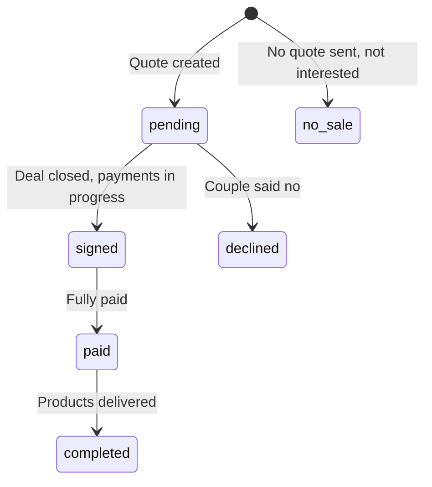
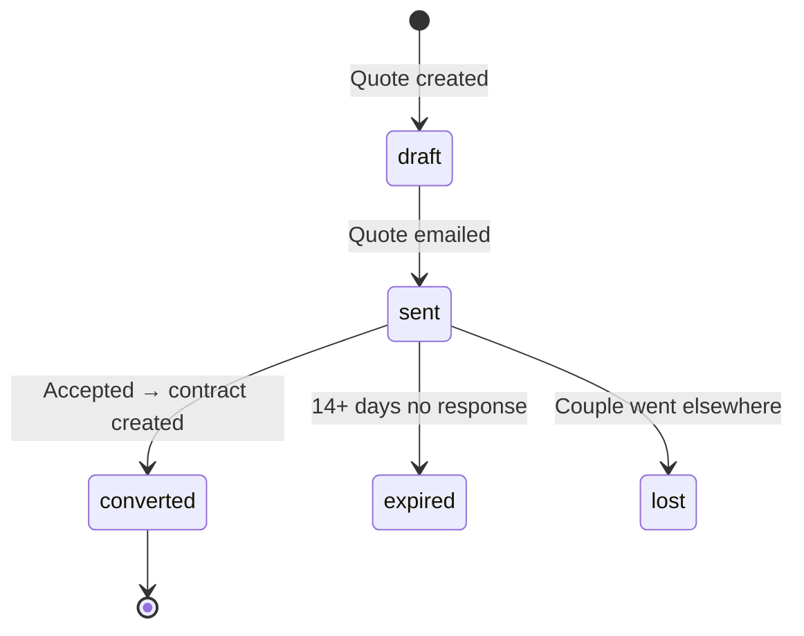
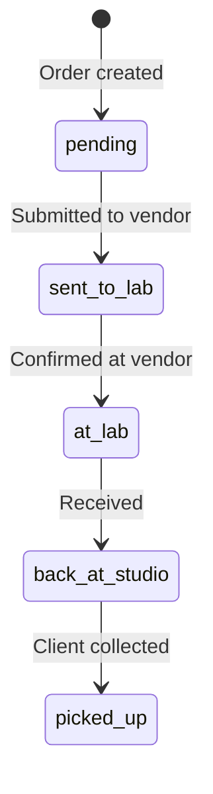

# STATE-MACHINES.md
**StudioFlow — Entity Status Transitions**
**Version:** 1.0
**Created:** April 25, 2026
**Last Verified:** April 25, 2026

---

## couples.status

| Value | Meaning | Set By |
|-------|---------|--------|
| `lead` | Initial inquiry | Manual or BridalFlow |
| `quoted` | Quote sent | Quote page |
| `booked` | Contract signed, active client | `convert_quote_to_contract` |
| `completed` | All deliverables done | `trg_auto_complete_couple_on_proofs` (auto) |
| `cancelled` | Cancelled/refunded | Manual |

**Rule:** `couples.status` is always lowercase. Never `'Booked'`, always `'booked'`.
**Rule:** `completed` should NEVER be set manually — only via auto-trigger.

---

## jobs.status (Photo Production)

| Value | Meaning | Triggers Milestone |
|-------|---------|-------------------|
| `ready_to_start` | Created, not started | — |
| `in_progress` | Actively editing | m06 (engagement only) |
| `completed` | Editing finished | m07 (engagement only) |
| `waiting_approval` | Client reviewing | — |
| `on_hold` | Paused | — |
| `at_lab` | Sent to CCI/UAF/Best Canvas | m08 (engagement), m26 (wedding — NO TRIGGER) |
| `at_studio` | Received back from vendor | m09 (engagement), m29 (wedding — NO TRIGGER) |
| `picked_up` | Client collected | m14 (engagement), m34 (wedding — NO TRIGGER) |

**Note:** Engagement jobs have full milestone trigger coverage. Wedding jobs do NOT — this is the gap that needs fixing in Project 2.

---

## video_jobs.status

| Value | Meaning | Triggers Milestone |
|-------|---------|-------------------|
| `not_started` | Created, waiting for photo order first | — |
| `in_progress` | Actively editing | — |
| `video_out` | First cut sent to couple | — |
| `waiting_for_bride` | Awaiting couple feedback | — |
| `waiting_on_recap` | Full video done, recap pending | — |
| `raw_video_output` | Raw export completed | — |
| `video_proofs_out` | Video proofs sent to couple | — |
| `complete` | Final video delivered | m27 (NO TRIGGER), m28 (NO TRIGGER) |
| `archived` | Raw footage archived | — |

**Note:** Video jobs have ZERO milestone triggers. This is a critical gap.

---

## extras_orders.status (C2 Frame Sales)

| Value | Meaning | Triggers Milestone |
|-------|---------|-------------------|
| `pending` | Quote created, awaiting couple | m10 (NO TRIGGER) |
| `signed` | Deal closed | m11 (NO TRIGGER) |
| `paid` | Fully paid | — |
| `completed` | Products delivered | — |
| `declined` | Couple declined | m11 (NO TRIGGER) |
| `no_sale` | No quote sent | — |

**DEPRECATED:** `active` — do not use. Migrate to `pending` or `signed`.

---

## client_quotes.status (Sales Pipeline)

| Value | Meaning | Triggers |
|-------|---------|----------|
| `draft` | Created, not sent | — |
| `pending` | Quote created, awaiting action | — |
| `sent` | Emailed to couple | — |
| `converted` | Accepted | — |
| `booked` | Contract created | `on_quote_status_change` → `convert_quote_to_contract` → seeds m01-m05 |
| `expired` | No response 14+ days | — |
| `lost` | Couple declined | — |

---

## client_orders.status (Lab Orders)

**Note:** `client_orders` table currently has 0 rows. This table was built but never populated. The Add Editing Job form doesn't use it yet.

---

## sales_meetings.status

| Value | Meaning |
|-------|---------|
| `Booked` | Consultation happened, couple booked |
| `Failed` | Consultation happened, couple did not book |

**Note:** Title Case (not lowercase like couples.status).

---

*Verified against production database on April 25, 2026.*
