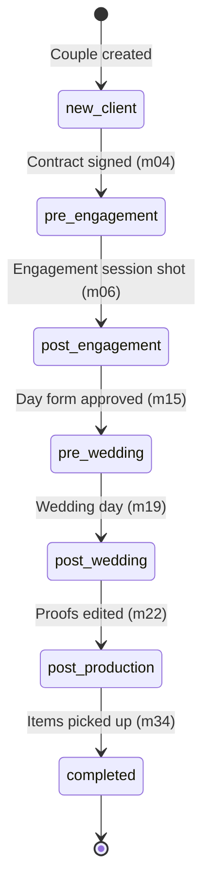
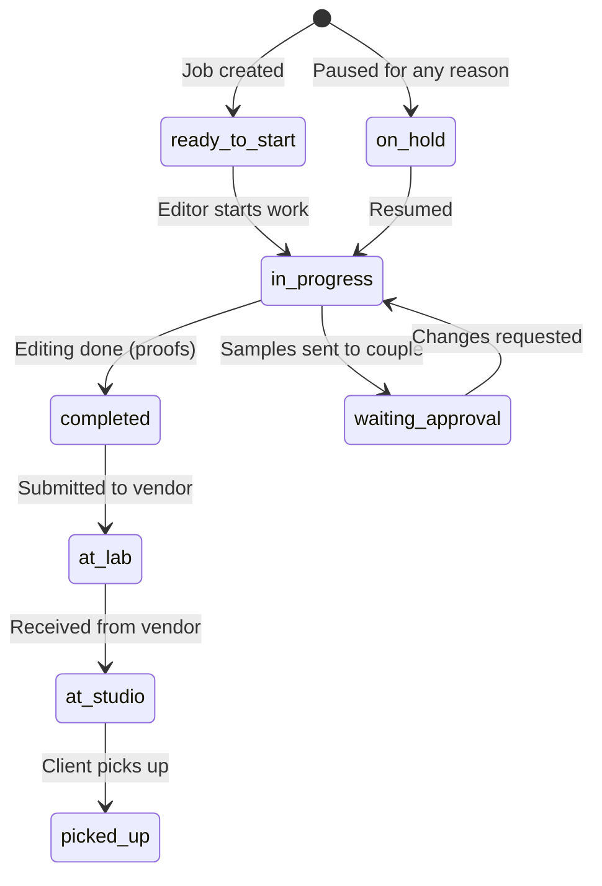
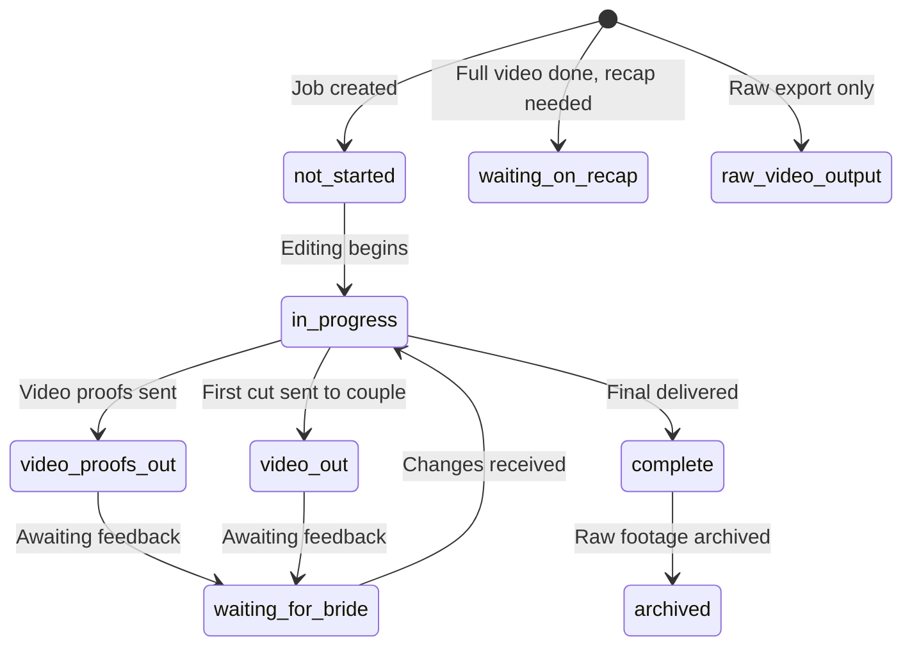
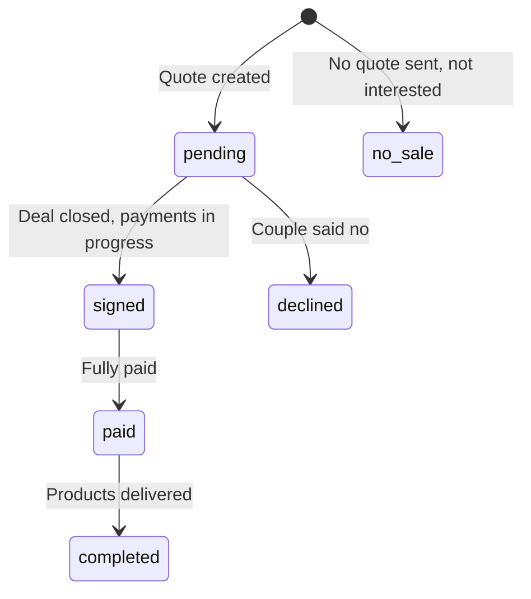
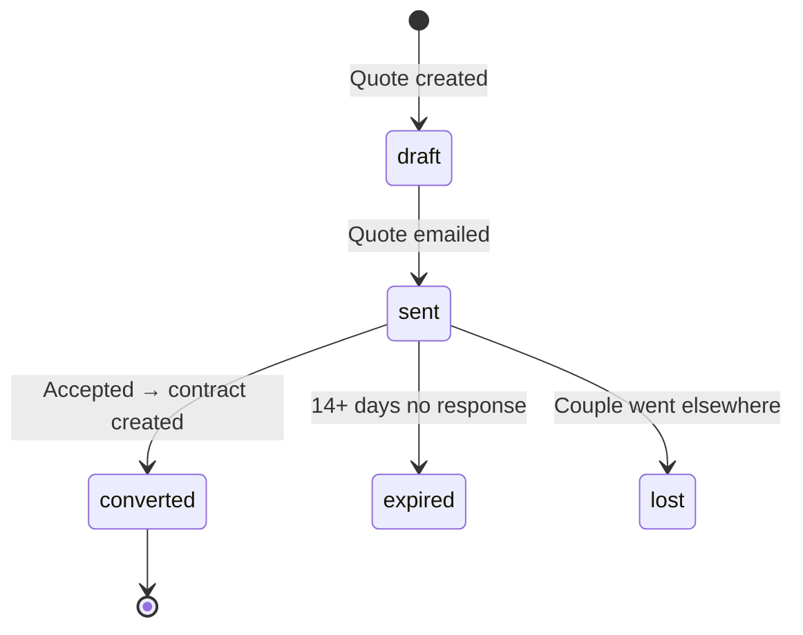
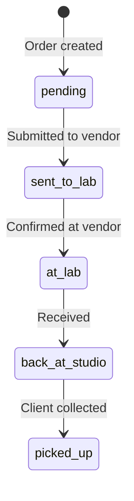

# STATE-MACHINES.md
**StudioFlow — Entity Status Transitions**
**Version:** 1.0
**Created:** April 25, 2026
**Last Verified:** April 25, 2026

---

## couples.phase (7-Phase Lifecycle)

Phase is the single source of truth for where a couple is in their journey. It only moves forward, never backward. The `trg_advance_couple_phase` trigger auto-advances phase when milestones change.

| Value | Meaning | Advanced By |
|-------|---------|------------|
| `new_client` | Initial state after creation | Default |
| `pre_engagement` | Contract signed, awaiting engagement | m04 milestone |
| `post_engagement` | Engagement shot, entering production | m06 milestone |
| `pre_wedding` | Day form approved, wedding upcoming | m15 milestone |
| `post_wedding` | Wedding day occurred | m19 milestone |
| `post_production` | Proofs edited, orders in progress | m22 milestone |
| `completed` | All items picked up, journey complete | m34 milestone |

**Rule:** Phase only moves forward. Never set phase to an earlier value.
**Rule:** Phase is advanced by the `trg_advance_couple_phase` database trigger — never manually updated in frontend code.

### couples.is_cancelled (Separate Flag)

Cancellation is independent of phase. A couple at any phase can be cancelled.

| Value | Meaning |
|-------|---------|
| `false` (default) | Active couple |
| `true` | Cancelled/refunded |

**Rule:** Cancelled couples are hidden from all listings by default (filter `is_cancelled = false`). They only appear when explicitly requested.

---

## jobs.status (Photo Production)

| Value | Meaning | Triggers Milestone |
|-------|---------|-------------------|
| `ready_to_start` | Created, not started | — |
| `in_progress` | Actively editing | m06 (engagement only) |
| `completed` | Editing finished | m07 (engagement only) |
| `waiting_approval` | Client reviewing | — |
| `on_hold` | Paused | — |
| `at_lab` | Sent to CCI/UAF/Best Canvas | m08 (engagement proofs), m12 (engagement non-proofs), m26 (wedding non-proofs — first item) |
| `at_studio` | Received back from vendor | m09 + m13 (engagement — auto-paired), m29 (wedding — first item), m32 (wedding — when ALL non-proofs ready) |
| `picked_up` | Client collected | m14 (engagement), m30 + m31 + m34 (wedding — ALL picked_up via `trg_flip_m34_all_picked_up`) |

**Note:** Engagement jobs have full milestone trigger coverage. Wedding jobs do NOT — this is the gap that needs fixing in Project 2.

---

## video_jobs.status

| Value | Meaning | Triggers Milestone |
|-------|---------|-------------------|
| `not_started` | Created, waiting for photo order first | — |
| `in_progress` | Actively editing | — |
| `video_out` | First cut sent to couple | — |
| `waiting_for_bride` | Awaiting couple feedback | — |
| `waiting_on_recap` | Full video done, recap pending | — |
| `raw_video_output` | Raw export completed | — |
| `video_proofs_out` | Video proofs sent to couple | — |
| `complete` | Final video delivered | m27 (`trg_flip_video_milestones` — FULL), m28 (`trg_flip_video_milestones` — RECAP) |
| `archived` | Raw footage archived | — |

**Note:** Video jobs have ZERO milestone triggers. This is a critical gap.

---

## extras_orders.status (C2 Frame Sales)

| Value | Meaning | Triggers Milestone |
|-------|---------|-------------------|
| `pending` | Quote created, awaiting couple | m10 (`trg_flip_m10_on_extras_insert` — fires on INSERT) |
| `signed` | Deal closed | m11 (`trg_flip_m11_on_extras_status`) |
| `paid` | Fully paid | — |
| `completed` | Products delivered | — |
| `declined` | Couple declined | m11 (`trg_flip_m11_on_extras_status`) |
| `no_sale` | No quote sent | — |

**DEPRECATED:** `active` — do not use. Migrate to `pending` or `signed`.

---

## client_quotes.status (Sales Pipeline)

| Value | Meaning | Triggers |
|-------|---------|----------|
| `draft` | Created, not sent | — |
| `pending` | Quote created, awaiting action | — |
| `sent` | Emailed to couple | — |
| `converted` | Accepted | — |
| `booked` | Contract created | `on_quote_status_change` → `convert_quote_to_contract` → seeds m01-m05 |
| `expired` | No response 14+ days | — |
| `lost` | Couple declined | — |

---

## client_orders.status (Lab Orders)

**Note:** `client_orders` table currently has 0 rows. This table was built but never populated. The Add Editing Job form doesn't use it yet.

---

## sales_meetings.status

| Value | Meaning |
|-------|---------|
| `Booked` | Consultation happened, couple booked |
| `Failed` | Consultation happened, couple did not book |

**Note:** Title Case (not lowercase like couples.phase).

---

*Verified against production database on April 25, 2026.*
